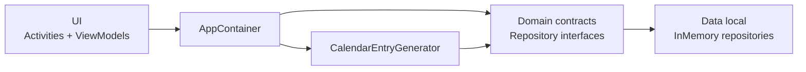
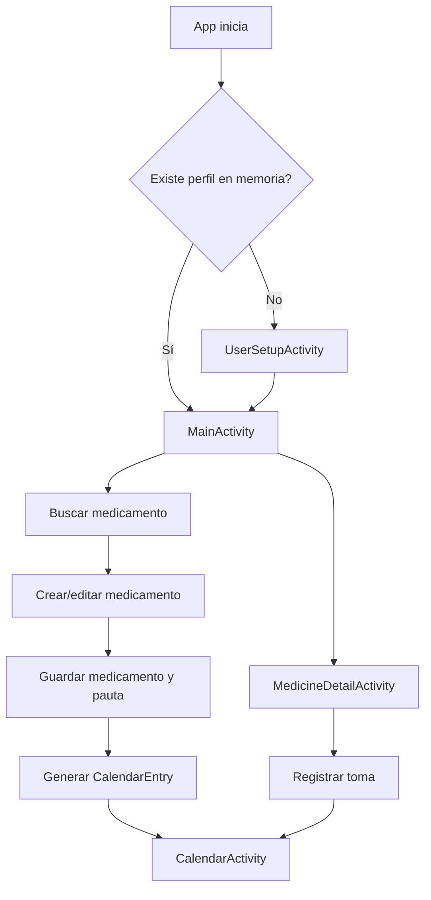
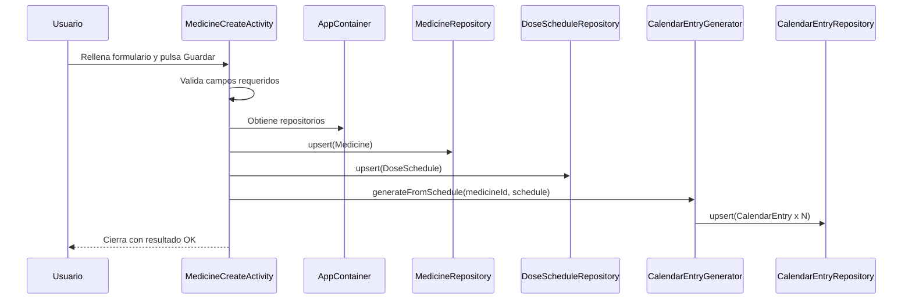
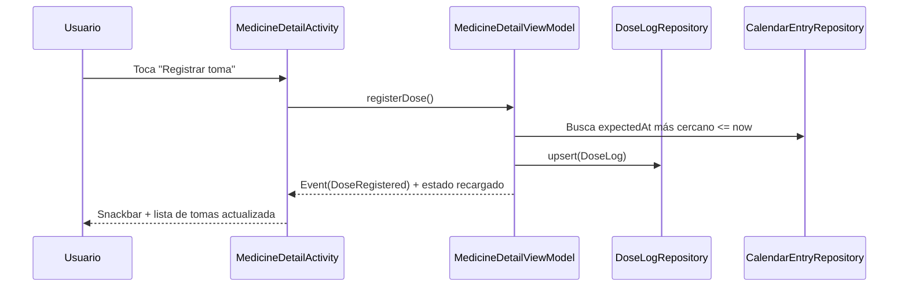

# Exposición del proyecto Band-AId (v0.1.x)

Este documento te sirve como guion simple para explicar y defender el
proyecto en clase. Resume qué hace la app, qué tecnologías usa, cómo está
organizada, dónde guarda datos y cuáles son sus flujos principales.

## 1. Qué problema resuelve

Band-AId es una app Android local para:

- Registrar un perfil básico de usuario.
- Crear medicamentos con su pauta.
- Generar entradas de calendario de tomas.
- Registrar tomas realizadas.
- Consultar estado de tomas en una vista de calendario.

No es una app médica clínica. No receta ni decide tratamientos.

## 2. Stack tecnológico real del proyecto

El proyecto usa un único módulo Android (`app`) con arquitectura por capas
sencilla.

- Lenguaje: Kotlin.
- UI: XML + ViewBinding.
- Patrón de presentación: Activity + ViewModel (LiveData).
- Listas: RecyclerView (pantalla principal).
- Diseño UI: Material Components (Material3).
- Build: Gradle + Android Gradle Plugin.
- JDK: Java 17.
- SDK Android: minSdk 26, target/compile 34.

## 3. Dependencias usadas (exactas)

Estas son las dependencias declaradas en `app/build.gradle` y
`gradle/libs.versions.toml`.

| Dependencia | Versión | Uso en la app |
|---|---|---|
| `androidx.core:core-ktx` | `1.12.0` | Extensiones Kotlin de Android. |
| `androidx.appcompat:appcompat` | `1.6.1` | Compatibilidad de Activities/Toolbar. |
| `com.google.android.material:material` | `1.11.0` | Componentes Material3 (Toolbar, botones, chips, Snackbar, etc.). |
| `androidx.lifecycle:lifecycle-viewmodel-ktx` | `2.7.0` | ViewModel para estado de UI. |
| `androidx.lifecycle:lifecycle-livedata-ktx` | `2.7.0` | LiveData para observar estado/eventos. |
| `androidx.recyclerview:recyclerview` | `1.3.2` | Lista de medicamentos activos. |

## 4. Arquitectura explicada en simple

La app sigue una separación clara:

- `ui/`: Activities, adapters y ViewModels.
- `domain/`: modelos y contratos de repositorio.
- `data/local/`: implementaciones en memoria (`InMemory...`).
- `di/`: `AppContainer` para inyectar dependencias manualmente.

### Diagrama de arquitectura



## 5. Dónde se almacenan los datos

Todos los datos se guardan en memoria RAM durante la ejecución.

- Al cerrar la app, se pierde todo.
- No hay Room, SQLite, DataStore ni backend.
- No hay sincronización en nube.

### Stores/repositorios de datos

| Clase | Qué guarda |
|---|---|
| `InMemoryMedicineRepository` | Medicamentos (`Medicine`). |
| `InMemoryDoseScheduleRepository` | Pautas (`DoseSchedule`). |
| `InMemoryCalendarEntryRepository` | Entradas esperadas (`CalendarEntry`). |
| `InMemoryDoseLogRepository` | Tomas registradas (`DoseLog`). |
| `InMemoryUserRepository` | Usuario dominio (`User`). |
| `InMemoryUserProfileStore` | Perfil UI (`UserProfile`). |
| `InMemoryMedicineMetaStore` | Metadatos UI (duración de tratamiento). |

## 6. Pantallas y vistas que existen

La app tiene 5 Activities principales y 10 layouts XML.

### Activities

| Activity | Layout | Función principal |
|---|---|---|
| `MainActivity` | `activity_main.xml` | Lista de medicamentos activos, acceso a calendario y ajustes. |
| `UserSetupActivity` | `activity_user_setup.xml` | Alta/edición del perfil de usuario con validación. |
| `MedicineSearchActivity` | `activity_medicine_search.xml` | Búsqueda local stub para prefijar creación. |
| `MedicineCreateActivity` | `activity_medicine_create.xml` | Crear/editar medicamento y pauta de horarios. |
| `MedicineDetailActivity` | `activity_medicine_detail.xml` | Ver detalle, registrar toma, activar/desactivar, eliminar. |
| `CalendarActivity` | `activity_calendar.xml` | Vista diaria de tomas esperadas (pendiente/tomada). |

### Layouts item

- `item_medicine.xml`
- `item_medicine_suggestion.xml`
- `item_calendar_entry.xml`
- `item_dose_log.xml`

### Menús

- `menu_main.xml`: acciones de calendario y configuración.
- `menu_medicine_detail.xml`: editar, activar/desactivar y eliminar.

## 7. Flujo funcional principal

Este flujo resume el recorrido normal del usuario.



## 8. Flujos técnicos importantes (Mermaid)

### 8.1 Crear medicamento y generar calendario



### 8.2 Registrar toma desde detalle



## 9. Clases clave para explicar en clase

Estas son las clases más importantes para defender diseño.

- `BandAidApplication`: crea un único `AppContainer`.
- `AppContainer`: punto de wiring de repositorios/fábricas.
- `CalendarEntryGenerator`: traduce una pauta en entradas concretas.
- `MainViewModel`: estado de lista principal.
- `CalendarViewModel`: estado de día seleccionado y entradas.
- `MedicineDetailViewModel`: lógica de detalle (toma, toggle, borrar).

## 10. Ejemplos de código relevante

### 10.1 Inyección manual con AppContainer

```kotlin
class BandAidApplication : Application() {
    val appContainer: AppContainer by lazy { AppContainer() }
}
```

```kotlin
class AppContainer {
    val medicineRepository: MedicineRepository = InMemoryMedicineRepository()
    val doseScheduleRepository: DoseScheduleRepository = InMemoryDoseScheduleRepository()
    val calendarEntryRepository: CalendarEntryRepository = InMemoryCalendarEntryRepository()
    val calendarEntryGenerator: CalendarEntryGenerator =
        CalendarEntryGenerator(calendarEntryRepository)
}
```

### 10.2 Generación de entradas de calendario

```kotlin
fun generateFromSchedule(medicineId: String, schedule: DoseSchedule) {
    val endDate = schedule.endDate ?: schedule.startDate.plusDays(30)
    var currentDate = schedule.startDate

    while (!currentDate.isAfter(endDate)) {
        for (time in schedule.timesOfDay) {
            calendarEntryRepository.upsert(
                CalendarEntry(
                    id = UUID.randomUUID().toString(),
                    medicineId = medicineId,
                    scheduleId = schedule.id,
                    expectedAt = LocalDateTime.of(currentDate, time),
                    isCompleted = false
                )
            )
        }
        currentDate = currentDate.plusDays(schedule.frequencyDays.toLong())
    }
}
```

### 10.3 Validación de formulario en setup

```kotlin
val age = binding.inputAge.text?.toString()?.trim()?.toIntOrNull()
if (age == null || age !in 1..150) {
    binding.layoutAge.error = getString(R.string.error_invalid_age)
    hasError = true
}
```

## 11. Decisiones técnicas

Estas decisiones están alineadas con el alcance académico de v0.1.x.

- Se usa almacenamiento en memoria para iterar rápido en UI y flujo.
- Se separa `domain` de `data` para poder cambiar persistencia luego.
- Se usa `ViewModel + LiveData` para estado simple y estable.
- Se evita sobreingeniería (sin backend, sin workers, sin Room en esta fase).
- Se usa Material3 para consistencia visual y componentes estándar.

## 12. Limitaciones actuales (importante decirlo)

- Los datos no sobreviven al cierre de la app.
- No hay notificaciones automáticas.
- No hay ejecución en segundo plano.
- La búsqueda de medicamentos es stub local.
- No hay autenticación ni multiusuario real.

## 13. Mejoras futuras naturales

- Persistencia local con Room.
- Alarmas/notificaciones con WorkManager/AlarmManager.
- Fuente real de medicamentos (API externa controlada).
- Tests unitarios de ViewModel y repositorios.
- Migrar a navegación con fragments o Compose en una fase posterior.


