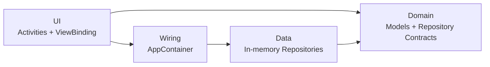

# Arquitectura v0.1 (Conceptual)

```mermaid
flowchart LR
    UI[UI\nActivities + ViewBinding] --> W[Wiring\nAppContainer]
    W --> D[Data\nIn-memory Repositories]
    UI --> DM[Domain\nModels + Repository Contracts]
    D --> DM
```

Diagrama conceptual de capas: no hay Clean Architecture formal, no hay framework de DI y no existe persistencia real.
