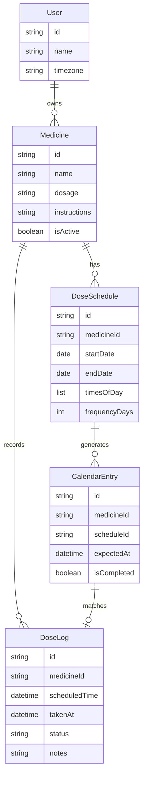

# Modelo de Dominio

```mermaid
erDiagram
    User ||--o{ Medicine : owns
    Medicine ||--o{ DoseSchedule : has
    DoseSchedule ||--o{ CalendarEntry : generates
    Medicine ||--o{ DoseLog : records
    CalendarEntry ||--o| DoseLog : matches

    User {
        string id
        string name
        string timezone
    }
    Medicine {
        string id
        string name
        string dosage
        string instructions
        boolean isActive
    }
    DoseSchedule {
        string id
        string medicineId
        date startDate
        date endDate
        list timesOfDay
        int frequencyDays
    }
    CalendarEntry {
        string id
        string medicineId
        string scheduleId
        datetime expectedAt
        boolean isCompleted
    }
    DoseLog {
        string id
        string medicineId
        datetime scheduledTime
        datetime takenAt
        string status
        string notes
    }
```

El modelo representa las relaciones definidas en los documentos de dominio; en v0.1 algunas relaciones son conceptuales.
