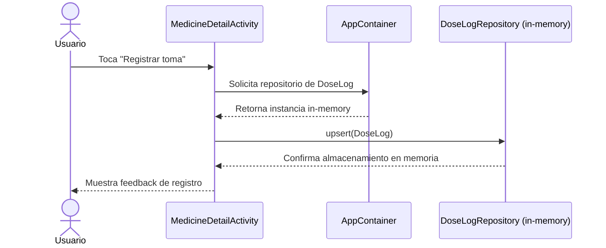

# Secuencia: Registro Manual de Toma (v0.1)

```mermaid
sequenceDiagram
    actor Usuario
    participant MDA as MedicineDetailActivity
    participant AC as AppContainer
    participant DLR as DoseLogRepository (in-memory)

    Usuario->>MDA: Toca "Registrar toma"
    MDA->>AC: Solicita repositorio de DoseLog
    AC-->>MDA: Retorna instancia in-memory
    MDA->>DLR: upsert(DoseLog)
    DLR-->>MDA: Confirma almacenamiento en memoria
    MDA-->>Usuario: Muestra feedback de registro
```

La secuencia muestra el flujo local y determinista de v0.1 sin persistencia real.
